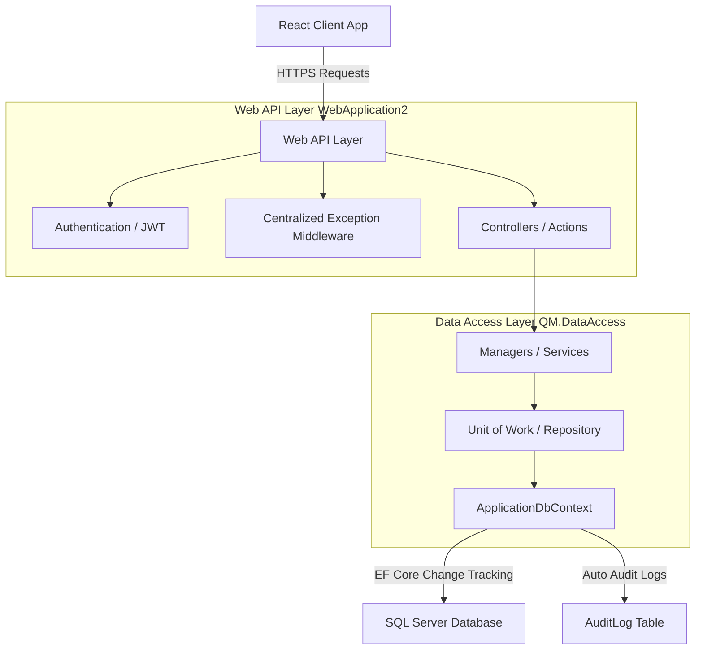
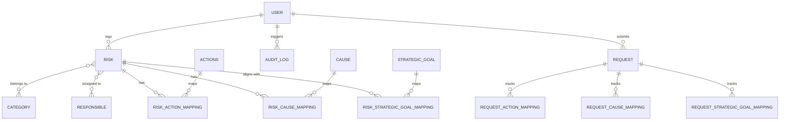
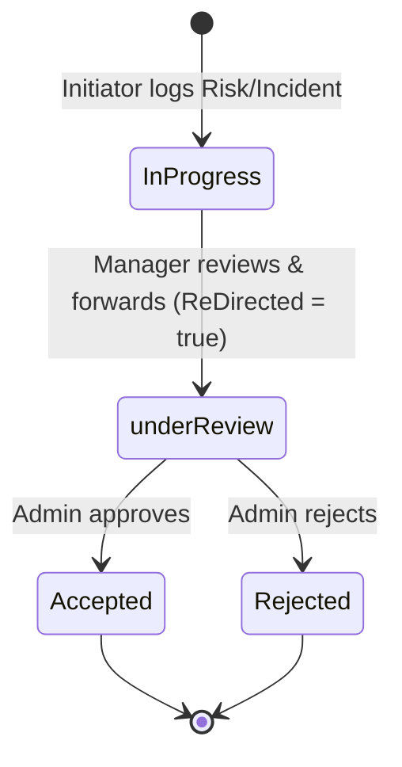
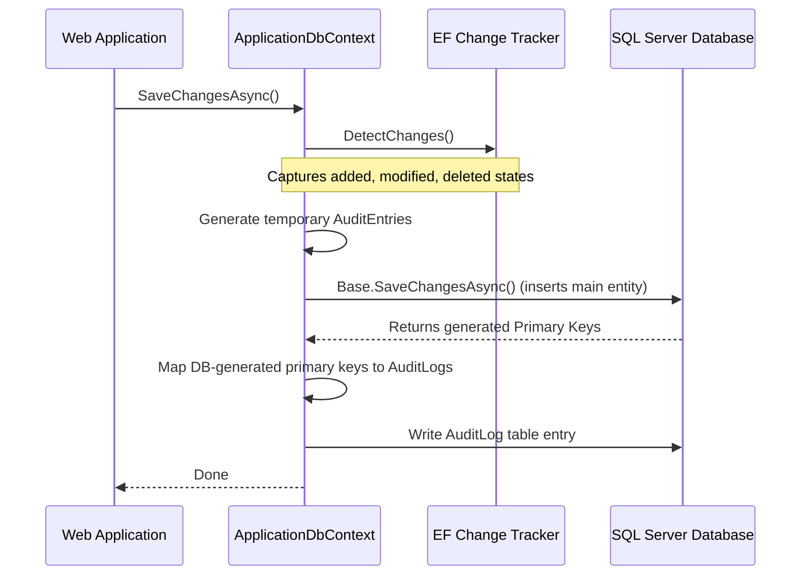

# Risk Management & Incident Tracking System

## Comprehensive Architecture & Technical Documentation

This document provides complete, professional technical documentation for the **Risk Management and Incident Tracking System**. It covers the architecture, data models, role-based security workflows, audit logging mechanism, and the API endpoints.

---

## 1. System Architecture Overview

The system is built as a decoupled full-stack application. The backend is an **ASP.NET Core Web API** powered by **.NET 9.0** and **Entity Framework Core**, connected to a **Microsoft SQL Server** database.



### Key Architectural Patterns

- **Repository & Unit of Work Pattern**: Decouples the business operations (`Manager<T>`) from the direct EF Core Context, facilitating cleaner testing and transaction scoping.
- **Global Interception Pipeline**: Features centralized validation (`ValidationFilter`) and unhandled exception management (`GlobalExceptionMiddleware`) to guarantee consistent JSON response envelopes.
- **Auto-Audit Logging**: Overrides EF Core change tracking to automatically audit every database mutation (Create, Update, Delete) dynamically.

---

## 2. Database Schema & Models

The database features relationships capturing risks, actions, causes, and strategic goals, supported by intermediate mappings for many-to-many relationships.

### Database ER Diagram



### Core Entities & Domain Models

1. **User (`User.cs`)**:
   - Extends `IdentityUser<int>`. Includes custom properties such as `EmployeeId` (6-digit check constraint) and `ManagerId` (reports-to relationship).
   - Customized database schema: The default unique index on `NormalizedUserName` is modified to **non-unique** (`IsUnique(false)`) to support optional duplicate usernames with custom validators.
2. **Risk (`Risk.cs`)**:
   - Represents a identified risk in the catalog.
   - Properties: `RiskName`, `RiskDescription`, `Location`, `likelihood`, `Impact`, `CategoryName`, `Department`, `Status` (Enum), `Custom` (Boolean flag distinguishing catalog library items from user suggestions).
3. **Incident Request (`Request.cs`)**:
   - Tracks an active incident/event that has occurred.
   - Links to a specific `RiskId` and includes post-impact metrics (`PostLikelihood`, `PostImpact`), expected resolution dates, and whether it occurred.
4. **Library Entities**:
   - **Actions (`Actions.cs`)**: Mitigating actions mapped to types like `Reduction` or `Avoidance`.
   - **Cause (`Cause.cs`)**: Root causes of risks.
   - **StrategicGoal (`StrategicGoal.cs`)**: High-level strategic business goals aligned with risks.

---

## 3. Security & Role-Based Workflows

The application features three main roles: **Initiator (`Initi`)**, **Manager**, and **Admin**. Workflows differ depending on the actor's clearance.

### Workflow Pipeline



### Access Scope Matrix

| Role                    | Risks Visibility                             | Incidents Visibility        | catalog / Lookup Access                 | Actions & Causes Rights              |
| :---------------------- | :------------------------------------------- | :-------------------------- | :-------------------------------------- | :----------------------------------- |
| **Initiator (`Initi`)** | Own risks only                               | Own incidents only          | Can see approved catalog (Custom=false) | Can create (saved as Custom=true)    |
| **Manager**             | Own risks + subordinate risks                | Own + subordinate incidents | Full access                             | Can create (saved as Custom=true)    |
| **Admin**               | Redirected risks only (`ReDirected == true`) | Redirected incidents only   | Full management & approval              | Full catalog curation (Custom=false) |

---

## 4. Automatic Audit Logging System

Every database change (inserts, updates, deletes) is tracked automatically. The `ApplicationDbContext` overrides `SaveChangesAsync` to analyze the EF Change Tracker before committing transaction writes.



### Logged Data Format

For every change, the system generates a JSON record containing:

- **TableName**: The name of the table being changed (e.g., `Risk`, `Request`).
- **Type**: `Create`, `Update`, or `Delete`.
- **PrimaryKey**: The record ID.
- **OldValues**: JSON object of the properties before the change.
- **NewValues**: JSON object of the properties after the change.
- **AffectedColumns**: List of fields modified during the operation.
- **UserId**: The ID of the authenticated user performing the action (resolved from HTTP Context claims).

---

## 5. API Reference & Controller Endpoints

### 🔑 Authentication (`api/auth`)

- **`POST api/auth/login`**: Accepts Email and Password. Returns JWT Token, Refresh Token, and user roles.
- **`POST api/auth/refresh`**: Accepts Refresh Token. Returns a new access token and a refreshed token.

### 👤 Admin User/Role Management (`api/admin` & `api/role`)

- **`POST api/admin/create-user`**: Admin-only. Registers new users with designated roles and manager assignments.
- **`GET api/admin/users`**: List all users along with their active role metadata.
- **`PUT api/admin/update-role`**: Updates user assignments and hierarchy reporting structures.
- **`POST api/role/create`**: Create a new role definition.
- **`DELETE api/role/{roleName}`**: Delete a role.

### ⚠️ Risk Catalog & Suggestions (`api/risk`)

- **`GET api/risk`**: Fetches risks. Scoped dynamically: Initiators see own; Managers see department; Admins see redirected items.
- **`POST api/risk/addUpdate`**: Creates or edits a risk mapping. Evaluates input, creates notifications, and handles many-to-many syncs for actions, causes, and goals.

### 🚨 Incident Tracking (`api/request`)

- **`GET api/request`**: List incidents with optional `pending=true/false` filter.
- **`POST api/request/addUpdate`**: Creates or updates incident logs and drives status transitions.

---

## 6. Centralized Error & Validation Handling

To keep client integrations simple, all error responses strictly follow the `ApiErrorResponse` schema:

```json
{
  "success": false,
  "statusCode": 400,
  "message": "One or more validation errors occurred.",
  "errors": {
    "Email": ["The Email field is required."]
  },
  "traceId": "0HN6Q3...:00000002",
  "timestamp": "2026-05-22T18:00:00.000Z"
}
```

### Error Components

1. **`GlobalExceptionMiddleware`**: Catches all unhandled controller errors. Translates custom `ApiException` subclasses (e.g. `NotFoundException`, `ConflictException`) to appropriate HTTP status codes, and conceals database exceptions under 500 Internal Server Errors in production.
2. **`ValidationFilter`**: Short-circuits requests failing `ModelState` validation, replacing standard validation responses with structured field errors.
3. **Custom Exceptions**: Developer exceptions thrown inside the application layer (`throw new NotFoundException("Message")`) automatically translate to precise HTTP status code responses.
