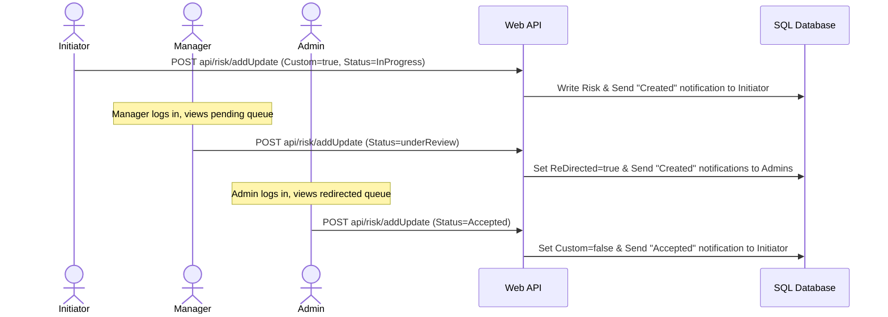
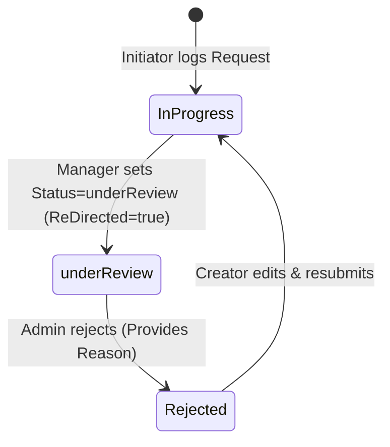
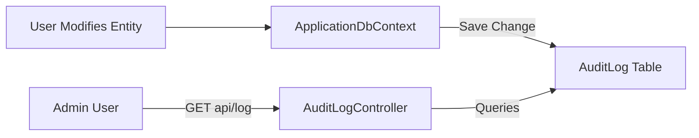

# Application Workflows & Scenarios

## Risk Management & Incident Tracking System

This document describes the key user workflows, operation steps, state changes, and notification paths for common operational scenarios.

---

## 1. Scenario: Risk Catalog Addition (Initiator -> Manager -> Admin)

This workflow describes how a new risk is suggested by a frontline employee (Initiator), reviewed/forwarded by their Manager, and approved into the catalog by an Admin.



### Step-by-Step Operations

#### Step 1: Initiator Submits Risk

- **Actor**: Initiator (`Initi`)
- **Action**: Submits a new risk (e.g., "Slippery Corridor Floor") with `Custom = true` and `Status = InProgress`.
- **System Behavior**:
  - Saves risk to `Risks` table linked to the Initiator's `UserId`.
  - Saves a `created` notification in the `Notifications` table targeting the Initiator.
  - Writes a `Create` audit log entry in the `AuditLogs` table.

#### Step 2: Manager Reviews and Forwards

- **Actor**: Manager
- **Action**: Inspects the pending suggestion. Updates status to `underReview`.
- **System Behavior**:
  - Sets `ReDirected = true` on the risk.
  - Resolves all users with the `Admin` role.
  - Saves a `created` notification in the `Notifications` table for **each** Admin user.
  - Writes an `Update` audit log entry detailing the state transition.

#### Step 3: Admin Approves into Catalog

- **Actor**: Admin
- **Action**: Inspects the redirected suggestion and marks it `Accepted`.
- **System Behavior**:
  - Changes `Custom` flag from `true` to `false` (making it a library catalog item visible to everyone).
  - Saves an `accept` notification in the `Notifications` table targeting the original Initiator.
  - Writes an `Update` audit log entry.

---

## 2. Scenario: Incident Logging & Rejection Workflow

This scenario describes how an incident (occurrence of a risk) is logged, forwarded, and eventually rejected by an Admin with a specific reason.



### Step-by-Step Operations

#### Step 1: Initiator Logs Incident (Request)

- **Actor**: Initiator (`Initi`)
- **Action**: Logs a new Incident (e.g., "Chemical leak in Warehouse B") linking to an existing Risk. Sets `Status = InProgress` and `Occured = true`.
- **System Behavior**:
  - Saves entry to the `RiskRequests` (Request) table.
  - Maps selected Actions, Causes, and Goals.
  - Logs a `created` notification for the Initiator.

#### Step 2: Manager Forwards to Admin

- **Actor**: Manager
- **Action**: Reviews subordinate's incident report. Sets `Status = underReview`.
- **System Behavior**:
  - Sets `ReDirected = true` to make it visible to the Admin.
  - Dispatches notifications to all registered Admins.

#### Step 3: Admin Rejects Request

- **Actor**: Admin
- **Action**: Rejects request, inputting a rejection reason: `"Insufficient mitigation action detail provided."`
- **System Behavior**:
  - Saves `rejectReason` to the Request database row.
  - Sets `Status = Rejected` (ReDirected remains `true` so it stays in records history).
  - Creates a `reject` notification for the original creator.

#### Step 4: Initiator Corrects and Re-submits

- **Actor**: Initiator
- **Action**: Opens the rejected request, updates description/mitigations, and saves.
- **System Behavior**:
  - Updates the request.
  - Sets `Status = InProgress` and `ReDirected = false` (resetting workflow).

---

## 3. Scenario: Hierarchy & Manager Reassignment

This scenario describes how an Admin updates reporting relationships, and how the data visibility scopes dynamically adjust as a result.

### Before Reassignment

- Initiator `User A` reports to `Manager A` (`ManagerId = 100000`).
- `Manager A` can view all risks and incidents created by `User A` when querying `api/risk` or `api/request`.
- `Manager B` cannot see `User A`'s records.

### Operations

1. **Admin Action**: Calls `PUT api/admin/update-role` with payload:
   ```json
   {
     "userName": "User A",
     "newRole": "Initi",
     "managerId": 100001
   }
   ```
   _(Note: Manager B's Employee ID is 100001)_.
2. **System Behavior**:
   - Updates `User A`'s database record, setting `ManagerId = 100001`.
   - Automatically logs an `Update` audit record containing the old and new manager IDs.

### After Reassignment

- `Manager B` (`100001`) queries `api/risk` or `api/request`.
- The system evaluates:
  `filter = filter.And(r => r.UserId == userId || (r.User != null && r.User.ManagerId == userId))`
- `Manager B` can now see `User A`'s historical records.
- `Manager A` no longer has access to `User A`'s records.

---

## 4. Scenario: Audit Trail Logging & History Search

This scenario outlines how the automatic audit logging mechanism responds to database changes and how admins trace activity.



### Steps:

1. **Modification**: User logs in and updates a risk description.
2. **Auto-Capture**: Before saving changes, the database context:
   - Inspects change tracker modified properties.
   - Collects `OldValues` (e.g. `{"RiskDescription": "Old text"}`) and `NewValues` (e.g. `{"RiskDescription": "New text"}`).
3. **Save**: Writes the data changes along with the audit log.
4. **Retrieval**: Admin accesses the audit panel to search for changes. The system serves audit log lists showing:
   - Who made the change.
   - The exact values before and after the change.
   - Exact timestamp.
   - Specific modified columns.
